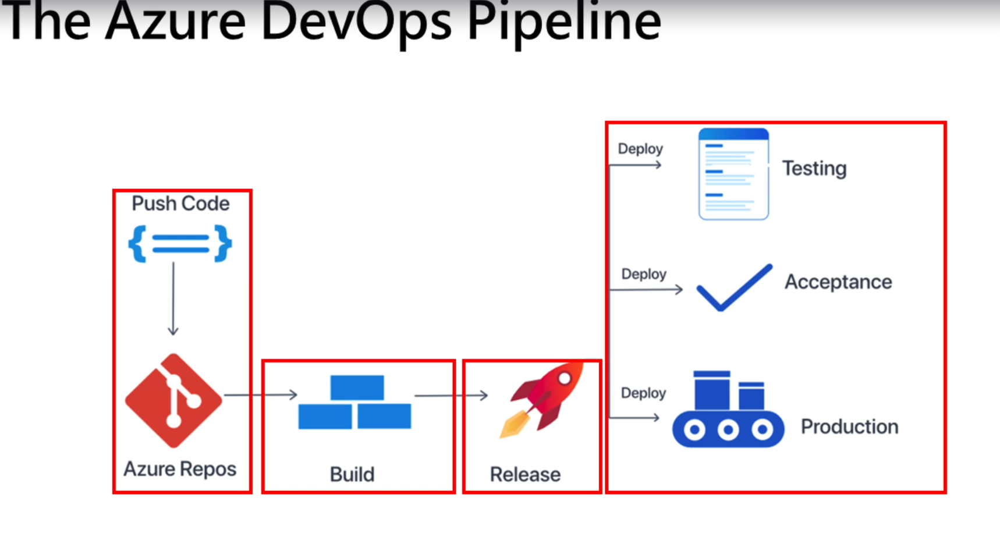

# Continuous Integration and Delivery

## The Anatomy of an Azure Repo with Git

## Lesson 77

### Continuous Integration

1. **Developers write and commit code** to a repository frequently.
2. **Automated build process** compiles the code and runs tests to create artifacts.
3. **Automated tests** (unit tests, integration tests) validate the code changes.
4. **Package the compiled code** and dependencies into deployable packages.

### Continuous Delivery

1. **Automated deployment** process pushes the build artifacts.
2. **Automate the release** of the software to users or customers.
3. **Monitor the application** in production to ensure it functions correctly.

## Lesson 78

### Azure Git

- Build and Release Management (CI/CD)
- Work Item Tracking
- Pull Request Management
- Collaboration Tools
- Analytics and Reporting

## Lesson 80

### Git Line

Represents the repository.

### Branch Creation

Can be linked with a Work Item.

You can also create branch policies.

## Lesson 81

A pull request can automatically change a work item state.

## Lesson 84

### Cloning Repository

Makes a copy of a project or files within a repository.

### Fork

Server-side copy.

## Lesson 85

### Pipeline YAML File

Defines how to build and eventually publish an application.

#### Trigger

Defines when a pipeline should automatically run.

#### Pool

Specifies where the pipeline should run.

#### Steps

## Lesson 88

### Release Creation

Deploys the application.

## Lesson 89

### Automating Pipeline

## Lesson 91

You can insert pre-deployment and post-deployment conditions in a release pipeline.

## Lesson 95

### Review

---

<!-- Navigation Buttons -->

  <a href="session_07.md" 
     style="background-color: #0078D4; color: white; padding: 12px 20px; 
            border-radius: 8px; text-decoration: none; font-weight: bold; 
            box-shadow: 0 4px 12px rgba(0,0,0,0.15); display: inline-flex; 
            align-items: center; gap: 8px; margin-right: 10px;">
    ← Previous (session_07.md)
  </a>
  <a href="session_09.md" 
     style="background-color: #0078D4; color: white; padding: 12px 20px; 
            border-radius: 8px; text-decoration: none; font-weight: bold; 
            box-shadow: 0 4px 12px rgba(0,0,0,0.15); display: inline-flex; 
            align-items: center; gap: 8px;">
    Next (session_09.md) →
  </a>

